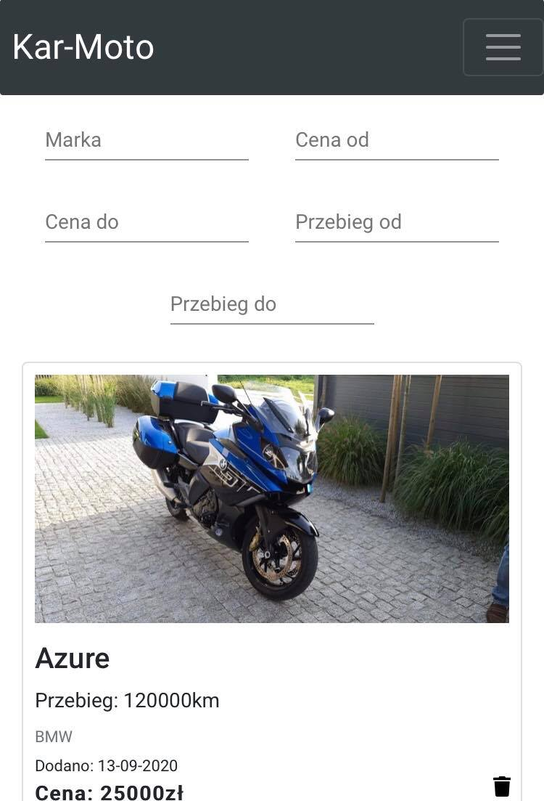
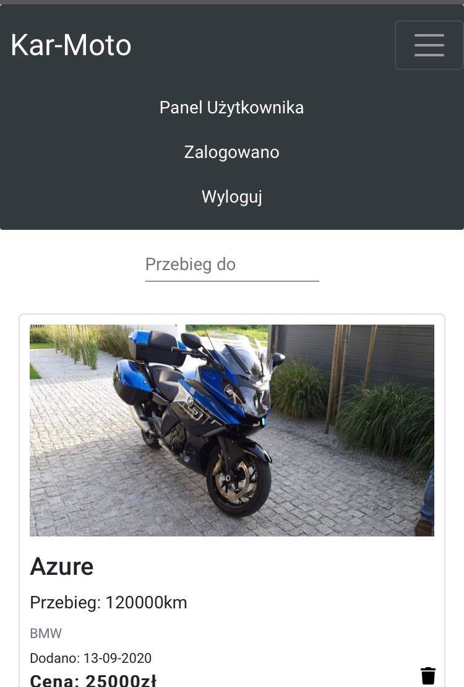
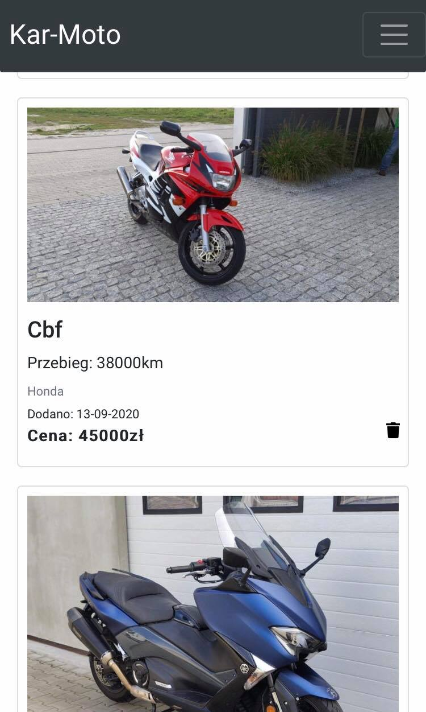
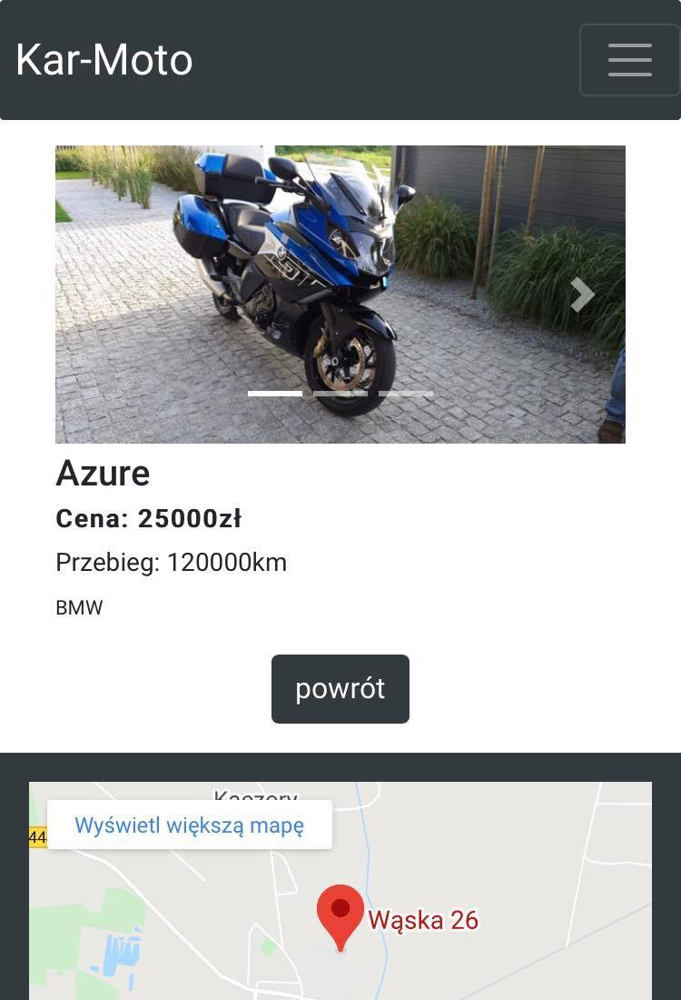
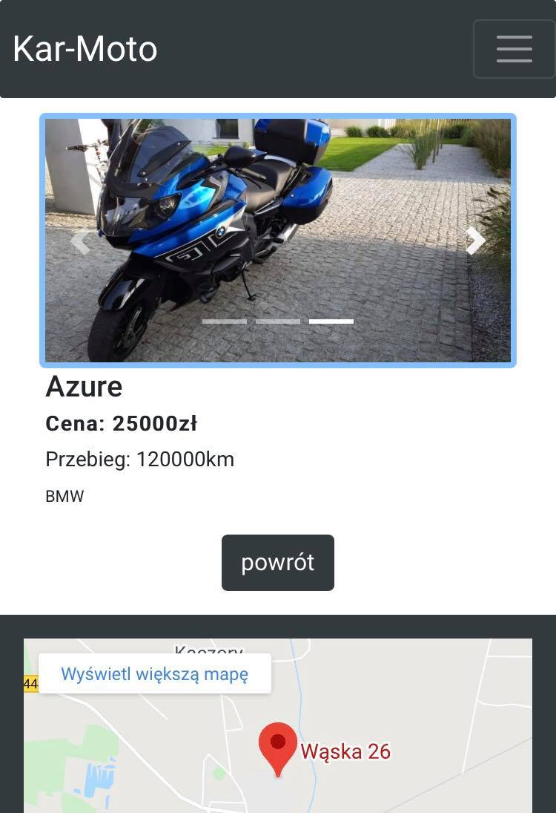
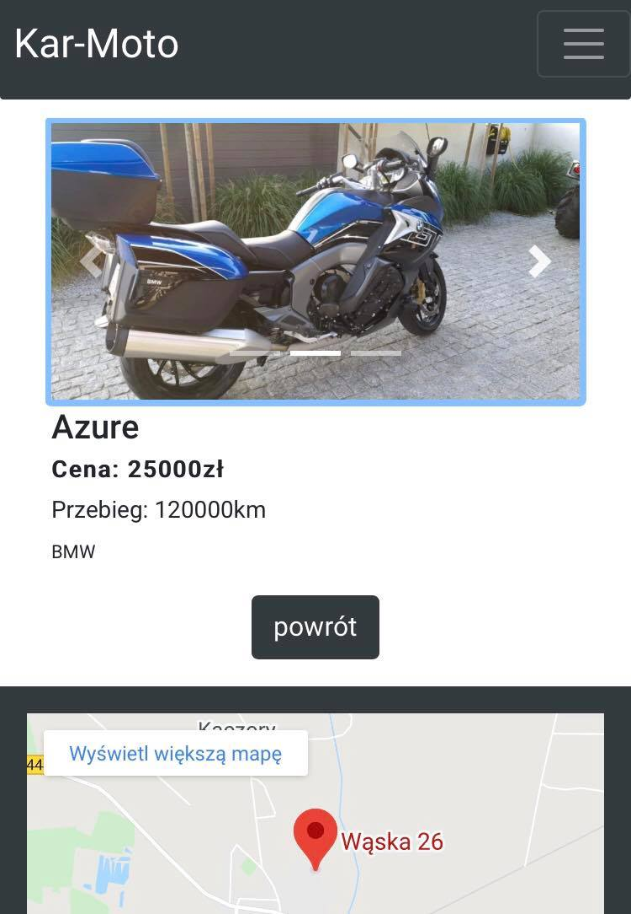
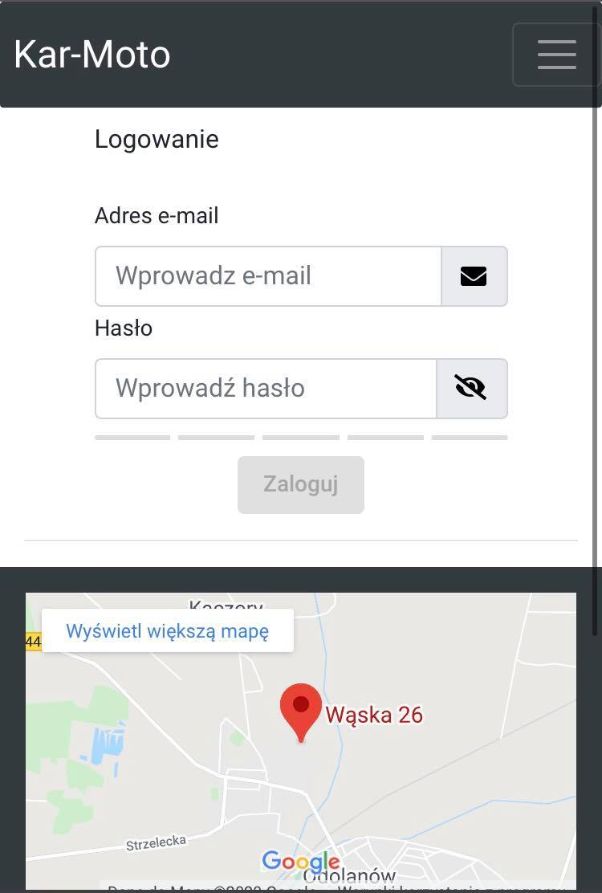
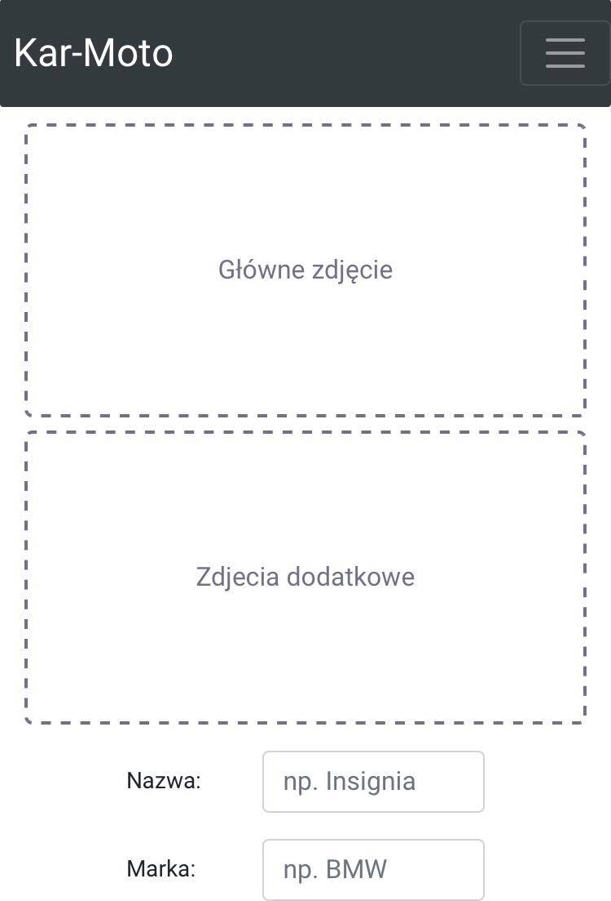
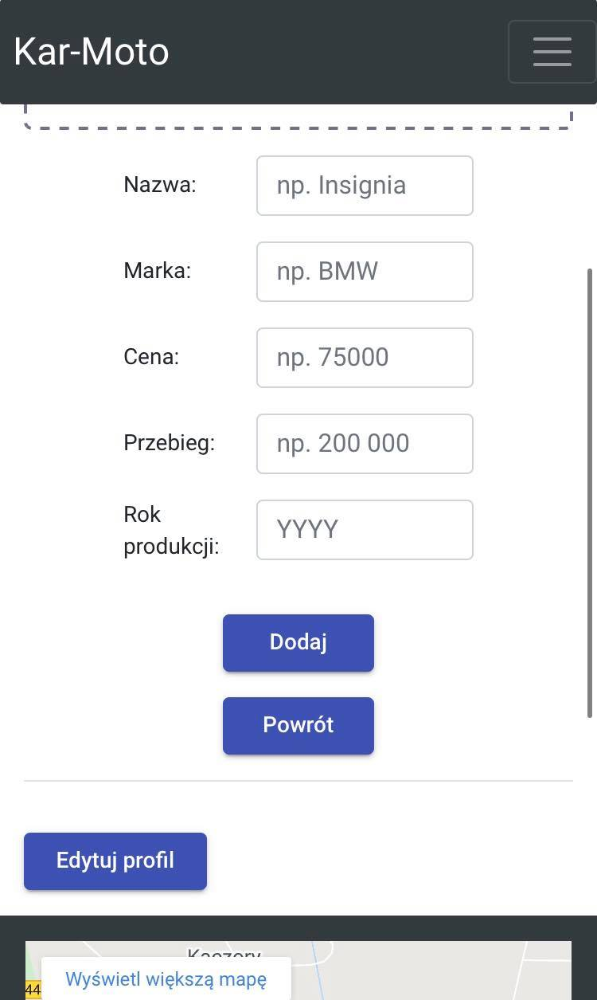

# Kar-Moto
Kar-Moto, a web application that allows the owner to freely manage the content on the website. 
Thanks to this, the user can add and remove products sold by him.

This project was generated with [Angular CLI](https://github.com/angular/angular-cli) version 9.1.7.

    

https://karmoto.pl

Mobile view

 

    

  

## Development server

Run `ng serve` for a dev server. Navigate to `http://localhost:4200/`. The app will automatically reload if you change any of the source files.

## Code scaffolding

Run `ng generate component component-name` to generate a new component. You can also use `ng generate directive|pipe|service|class|guard|interface|enum|module`.

## Build

Run `ng build` to build the project. The build artifacts will be stored in the `dist/` directory. Use the `--prod` flag for a production build.

## Running unit tests

Run `ng test` to execute the unit tests via [Karma](https://karma-runner.github.io).

## Running end-to-end tests

Run `ng e2e` to execute the end-to-end tests via [Protractor](http://www.protractortest.org/).

## Load all external packages
Run 'npm install' to download all packages.

## It is important to use proper Nodejs version.
https://nodejs.org/download/release/v14.21.3/

To get more help on the Angular CLI use `ng help` or go check out the [Angular CLI README](https://github.com/angular/angular-cli/blob/master/README.md).
"#forKarol" 

## Further help

To get more help on the Angular CLI use `ng help` or go check out the [Angular CLI README](https://github.com/angular/angular-cli/blob/master/README.md).
"# forKarol" 
